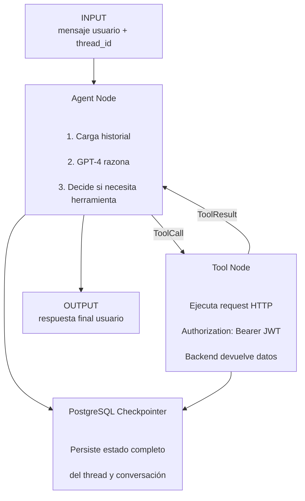
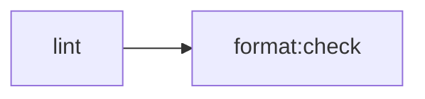

<div align="center">


# FinanzIA — Agent

**Agente conversacional de inteligencia artificial para finanzas personales**

_Interpreta lenguaje natural. Ejecuta herramientas financieras. Recuerda el contexto._

</div>

---

## Responsabilidad

Este repositorio es el cerebro conversacional de FinanzIA.

Implementa un agente de inteligencia artificial usando el patrón **ReAct (Reason + Act)** con LangGraph:

1. Recibe mensajes en lenguaje natural.
2. Razona qué acción debe ejecutar.
3. Ejecuta herramientas contra el backend Java.
4. Usa el JWT del usuario autenticado.
5. Sintetiza una respuesta coherente usando el historial de conversación.

El agente mantiene memoria persistente mediante el checkpointer de PostgreSQL integrado en LangGraph. El contexto sobrevive reinicios del servidor.

---

## Stack tecnológico

| Componente                  | Tecnología                        | Versión                   |
| --------------------------- | --------------------------------- | ------------------------- |
| Lenguaje                    | TypeScript strict                 | 5                         |
| Runtime                     | Node.js                           | 20                        |
| Framework de agentes        | LangGraph                         | 1.3.x                     |
| Orquestación LLM            | LangChain                         | 1.x                       |
| Modelo de lenguaje          | OpenAI GPT                        | `@langchain/openai` 1.4.x |
| Validación                  | Zod                               | 4.x                       |
| Persistencia conversaciones | PostgreSQL checkpointer           | —                         |
| Streams y colas             | Redis                             | —                         |
| Observabilidad              | LangSmith                         | —                         |
| Servidor agente             | LangGraph CLI (`langgraphjs dev`) | —                         |
| Contenedor                  | Docker                            | —                         |
| Calidad código              | ESLint + Prettier                 | —                         |

---

## ¿Qué puede hacer el agente?

El agente traduce lenguaje natural en operaciones financieras concretas.

| El usuario dice                         | Lo que ejecuta                 |
| --------------------------------------- | ------------------------------ |
| `"Gasté 35 mil en el almuerzo"`         | `create_transaction`           |
| `"¿Cuánto llevo gastado este mes?"`     | `get_transactions`             |
| `"Crea una categoría para el gimnasio"` | `create_category`              |
| `"Muéstrame mis últimos 5 gastos"`      | `get_transactions` con filtros |
| `"¿En qué categoría gasté más?"`        | Agrupación y comparación       |
| `"Cambia Gym a Fitness"`                | `update_category`              |
| `"¿Cuánto fue ese gasto?"`              | `get_transaction_detail`       |

---

## Herramientas disponibles

El agente tiene acceso a 7 herramientas que mapean directamente a la API REST del backend Java.

| Herramienta              | Endpoint                  | Descripción          |
| ------------------------ | ------------------------- | -------------------- |
| `get_categories`         | `GET /categories`         | Lista categorías     |
| `create_category`        | `POST /categories`        | Crear categoría      |
| `update_category`        | `PUT /categories/{id}`    | Editar categoría     |
| `delete_category`        | `DELETE /categories/{id}` | Eliminar categoría   |
| `get_transactions`       | `GET /transactions`       | Listar transacciones |
| `create_transaction`     | `POST /transactions`      | Crear transacción    |
| `get_transaction_detail` | `GET /transactions/{id}`  | Obtener detalle      |

Cada llamada incluye:

```http
Authorization: Bearer <jwt_token>
```

El backend valida el token en cada request.

---

## Inicio rápido

### Prerrequisitos

- Node.js 20+
- PostgreSQL
- Redis
- OpenAI API Key
- Backend Java corriendo en `http://localhost:8080`

### Configuración local

```bash
# 1. Clonar repositorio
git clone https://github.com/Proyecto-final-4/finanzIA-agent.git
cd finanzIA-agent

# 2. Instalar dependencias
npm install

# 3. Variables de entorno
cp .env.example .env

# 4. Crear base de datos
psql -U postgres -c 'CREATE DATABASE "finanzIA";'

# 5. Iniciar servidor
npm run dev
```

Servidor disponible en:

```text
http://localhost:2024
```

Frontend conectado usando:

```env
LANGGRAPH_API_URL=http://localhost:2024
LANGGRAPH_ASSISTANT_ID=financial_agent
```

---

## Scripts disponibles

| Comando                | Descripción             |
| ---------------------- | ----------------------- |
| `npm run dev`          | Servidor desarrollo     |
| `npm run build`        | Verificación TypeScript |
| `npm run lint`         | ESLint                  |
| `npm run format`       | Prettier auto-format    |
| `npm run format:check` | Validación formato      |

---

## Estructura del proyecto

```text
finanzIA-agent/
│
├── workflows/
│   └── agents/
│       └── financial-agent.ts
│
├── langgraph.json
├── .env.example
├── Dockerfile
├── .github/workflows/
├── eslint.config.mjs
├── package.json
└── tsconfig.json
```

---

## Configuración del servidor — `langgraph.json`

```json
{
  "node_version": "20",
  "graphs": {
    "financial_agent": "./workflows/agents/financial-agent.ts:agent"
  },
  "env": ".env",
  "store": {
    "uri": "${DATABASE_URI}"
  }
}
```

El grafo `financial_agent` se expone como endpoint del servidor LangGraph.

---

## Arquitectura del agente — patrón ReAct



---

## Persistencia de conversaciones

Cada sesión tiene un `thread_id` único generado por el frontend.

El checkpointer guarda:

- Historial de mensajes
- Tool calls
- Tool results
- Metadata
- Estado completo del grafo

Beneficios:

- El contexto sobrevive reinicios.
- Varias instancias comparten estado.
- El agente recuerda conversaciones previas.

---

## Variables de entorno

| Variable                 | Requerida   | Descripción              |
| ------------------------ | ----------- | ------------------------ |
| `BACKEND_JAVA_ENDPOINT`  | ✅ Sí       | URL backend Java         |
| `OPENAI_API_KEY`         | ✅ Sí       | Clave OpenAI             |
| `DATABASE_URI`           | ✅ Sí       | PostgreSQL checkpointer  |
| `REDIS_URI`              | ✅ Sí       | Redis                    |
| `LANGGRAPH_API_URL`      | ✅ Sí       | URL pública servidor     |
| `LANGGRAPH_ASSISTANT_ID` | ✅ Sí       | `financial_agent`        |
| `ALLOW_ORIGINS`          | ✅ Sí       | URLs frontend permitidas |
| `LANGCHAIN_TRACING_V2`   | Recomendada | Habilita trazas          |
| `LANGCHAIN_API_KEY`      | Recomendada | LangSmith API Key        |
| `LANGCHAIN_PROJECT`      | Recomendada | Proyecto LangSmith       |

Consultar `.env.example` para ejemplos completos.

---

## Observabilidad con LangSmith

Con:

```env
LANGCHAIN_TRACING_V2=true
```

LangSmith registra:

- Input y output del usuario
- Razonamiento del LLM
- Herramientas ejecutadas
- Tokens consumidos
- Costos estimados
- Latencias
- Estado del thread

Dashboard:

```text
https://smith.langchain.com
```

---

## Despliegue

### Docker

```bash
# Build imagen
docker build -t finanzia-agent .

# Ejecutar contenedor
docker run -p 2024:2024 --env-file .env finanzia-agent
```

### Railway

Variables recomendadas:

```env
DATABASE_URI=${{Postgres.DATABASE_URL}}
REDIS_URI=${{Redis.REDIS_URL}}
ALLOW_ORIGINS=${{Frontend.RAILWAY_PUBLIC_DOMAIN}}
```

Railway detecta automáticamente el `Dockerfile`.

---

## CI/CD

Pipeline GitHub Actions:



Deploy automático a Railway tras merge a `main` si el pipeline pasa.
